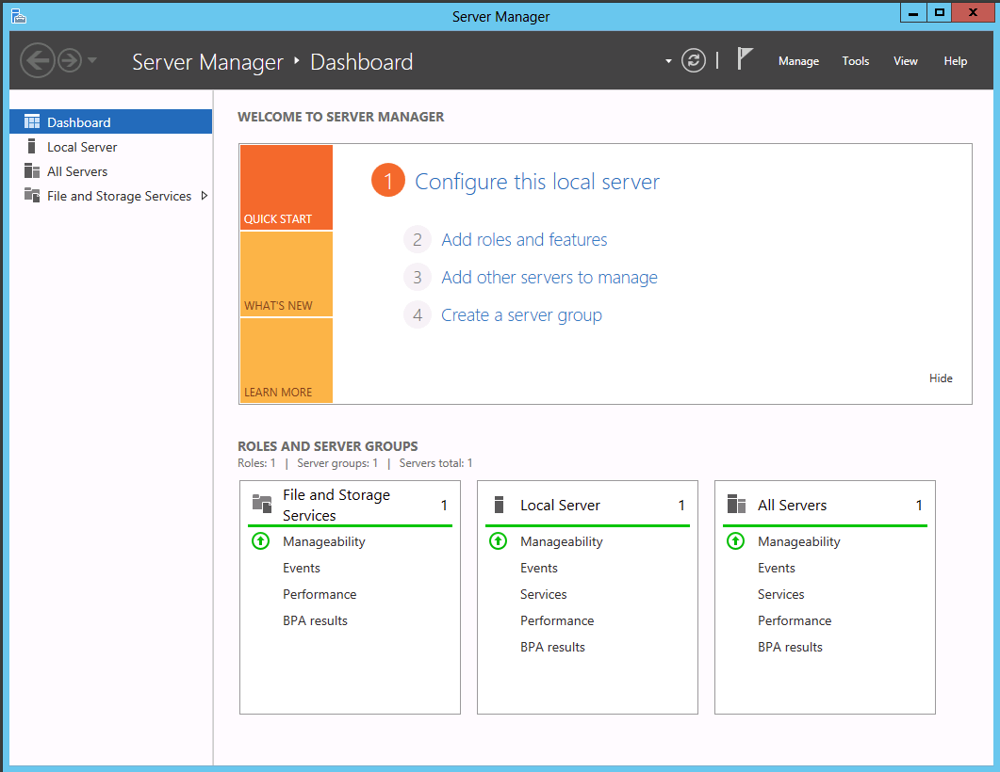
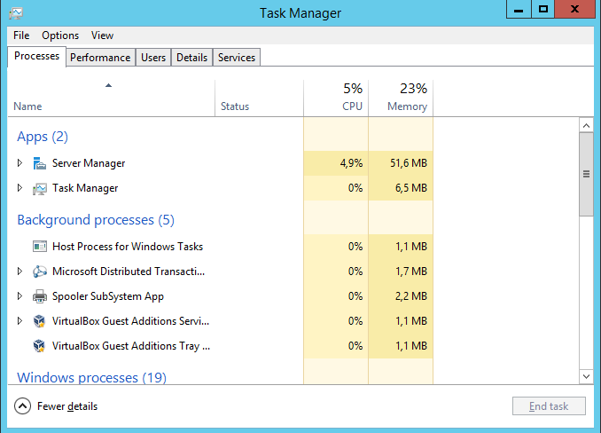
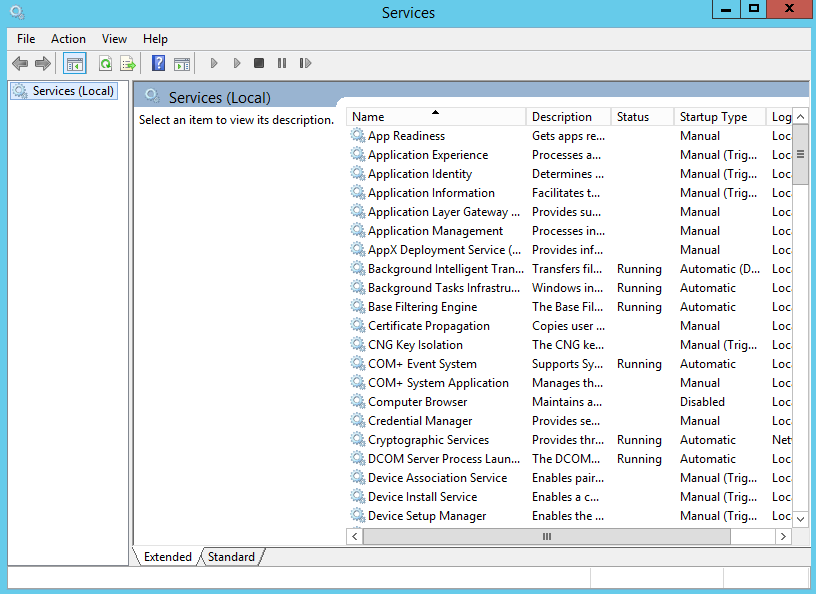
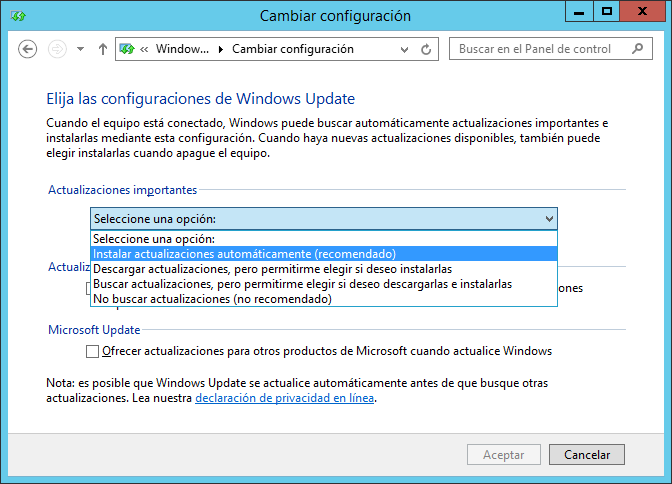
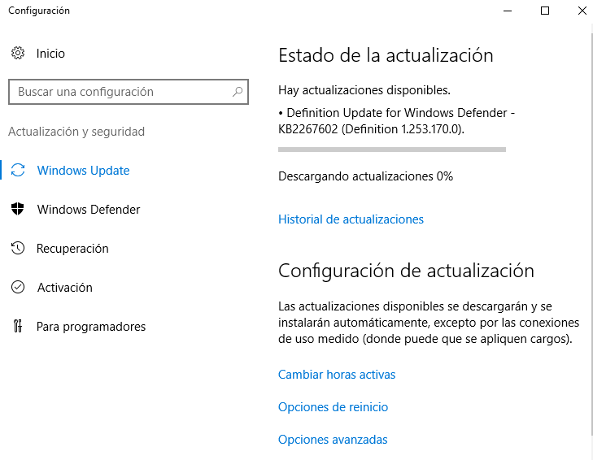
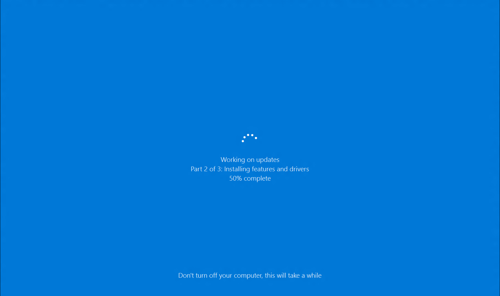

# Supervisió en Windows Server

## Tasques de l’administrador de sistemes

Algunes de **tasques d'un administrador de sistemes** d'informació:

* Instal·lació, configuració i reconfiguració del Sistema Operatiu 
* Instal·lació, actualització dels drivers i firmwares.
* Instal·lació de les **actualitzacions** crítiques i/o recomenables del sistema operatiu. 
  * Crítiques és important instal·lar-les, sempre que no afecti al funcionament del sistema d'informació. 
  * Recomanables depen de si ens soluciona un problema o no. 
* Gestió i comprovació de les **còpies de seguretat**. 
* **Monitorització i vigilar:**
  * l’estat del sistema comprovant el rendiment de l'equip
  * l’estat de la xarxa
  * l’estat dels serveis
  * l’espai físic d’emmagatzematge
  * els possibles problemes generats pel programari
  * etc

## Eines de supervisió

El sistema operatiu Microsoft Windows Server us proporciona una sèrie d’**eines** perquè pugueu **administrar el sistema** de manera efectiva i ràpida:

* **Administrador del servidor**
* **Administració de tasques**
* **Administració de serveis**
* **Administrador de discs**
* **Registre d’esdeveniments**

### Administrador del servidor _\[Server Manager\]_

L'**Administrador del servidor** permet veure, en una única pantalla, la informació del sistema, opcions de configuració de seguretat i els seus possibles problemes de configuració.

L'**Administrador del servidor**, amb una única eina, permet als administradors:

* Veure i modificar els **rols i característiques instal·lats** al servidor.
* Realitzar tasques d'administració com **iniciar o aturar serveis** i administrar comptes d'usuari locals.
* Determinar l'**estat del servidor**.
* Identificar **esdeveniments crítics**. 
* Analitzar i solucionar **problemes o errors de configuració**.

### Administrador de tasques _\[Task Manager\]_

L’**administrador de tasques** és l’eina principal per administrar processos i aplicacions del sistema.

Disposa de cinc pestanyes. Aquestes pestanyes us ajudaran a administrar **processos, rendiment, usuaris i serveis**.

* **Processos** _**\[Processes\]**_: aplicacions d'usuari i processos que s'estan executant en segon pla \(processos del sistema\), i la utilització què estan fent del sistema \(CPU i memòria\)
* **Detalls** _**\[Details\]**_: programes associats a les aplicacions. Permet canviar la prioritat de cada un
* **Usuaris** _**\[Users\]**_: quins usuaris estan connectats i quines aplicacions estan utilitzant; també es poden desconnectar usuaris.
* **Serveis** _**\[Services\]**_: quins serveis estan engegats o aturats. Permet aturar o iniciar serveis. També es pot obrir l'administrador de serveis per gestionar els serveis de forma més detallada.
* **Rendimient** _**\[Performance\]**_: veure la utilització global de la CPU, la memòria i la xarxa. Des d'aquest apartat es pot obrir el Monitor de recursos, que permet veure amb més detall la utilització de la CPU, la memòria, la xarxa i els discos.

Teniu **quatre vies per accedir** a l’administrador de tasques:

* Combinar les tecles _**Control, Majúscules i Esc**_.
* Combinar les tecles **Control, Alt i Supr** i escollir l’opció Iniciar l’administrador de tasques.
* Clicar a Inicio, escriure _**taskmgr**_ en el quadre de text, clicar a Iniciar la cerca i prémer Enter.
* Clicar amb el botó dret del ratolí a la barra d’eines i seleccionar l’opció _**Administrador de tasques**_.

### Administrador de serveis _\[Services\]_

> Els **serveis** són programes que funcionen sense interactuar directament amb l'usuari.

Normalment són programes que s'arranquen amb el sistema operatiu.

L'eina _**Serveis**_ mostra l'estat dels serveis i permet gestionar-los.

Cada servei el podem configurar: Ens posem a sobre &gt; boto dret ratolí &gt; propietats:

#### Configuració d'inici d'un servei

És important que feu la **configuració d’inici** dels serveis més escaient.

> Que un servei estigui instal·lat no vol dir que s'estigui executant.

Existeixen quatre **tipus d’arrencada d’un servei**:

* **Automàtic:** El servei que s’iniciarà quan l’equip s’engegui.
* **Automàtic \(inici retardat\):** el servei s’inicia quan l’equip està en marxa i tots els serveis automàtics \(marcats amb l’opció anterior\) estan funcionant. 
* **Manual:** el servei s’haurà d’iniciar manualment.
* **Deshabilitat:** el servei estarà desactivat i no es pot engegar.

> Tenir executant-se serveis que no fem servir consumirà recursos innecessaris.

#### Configuració de la recuperació d'un servei

El sistema Microsoft Windows Server permet fer accions si detecta que un servei específic falla.

Existeixen tres opcions de **recuperació d’un servei**:

* **No fer cap acció:** el sistema no intentarà recuperar-se d’aquest error, però sí de la resta.
* **Reiniciar el servei:** atura el servei, fa una pausa i el torna a iniciar.
* **Executar un programa:** si es produeix un error en aquest servei, es llançarà un script o un programa.

### Administrador de discs _\[Disk Management\]_

L'**administrador de discs** permet administrar els discs, particions i volums.

### Registre d’esdeveniments _\[Event Viewer\]_

El **registre d’esdeveniments** mostra a l’administrador informació sobre els error o avisos que s'han produït al sistema.

Els principals són:

* Registres de Windows
  * Aplicacions
  * Seguretat
  * Instal·lació
  * Sistema
* Registres d'aplicacions i serveis
  * Esdeveniments de hardware

## Actualitzacions

Una de les tasques que ha de fer l'administrador de sistemes és assegurar-se que els sistemes operatius s'**actualitzen** correctament.

En **versions anteriors de Windows Server 2016**, les actualitzacions venien deshabilitades de forma predeterminada. En canvi, en **Windows Server 2016**, la configuració predeterminada estableix que les actualitzacions es descarreguin però sigui l'administrador qui decideixi quan instal·lar-les.

### En versions anteriors a Windows Server 2016

En el **Windows Update** \(en Windows Server 2012 i Windows 8\) existeixen **quatre configuracions** possibles:

* **Instal·lar actualitzacions automàticament \(recomenat\)**.
  * Les actualitacions requereix reiniciar, per aquesta, raó si triem l'opció automàtica, **configurarem el dia i la hora** que no afecti al funcionanament de l'empresa o als processos del servidor o sistema informàtic. 
* **Descarregar actualitzacions, però deixar-me triar quan instal·lar-les**.
* **Buscar actualitzacions, però deixar triar si vull descarregar-es i intalar-les**.
  * Quan volem controlar quines actualitzacions s’instal·len.
* **No buscar actualitzacions \(no recomenat\)**
  * Podem instal·lar manualment les actualitzacions des de la web oficial de Windows.

### En Windows Server 2016

En el **Windows Update** \(en Windows Server 2016 i Windows 10\) podem configurar:

* **Canviar hores actives**  Un cop instal·lades actualitzacions, si és necessari reiniciar, tenim dos opcions:
  * reiniciar el servidor manualment 
  * esperar un reinici automàtic fora de les hores de major activitat del sistema.

    De forma predeterminada, les hores de major activitat estan definides entre les 8:00 i las 17:00. Si aquests valors no s'adapten a l'horari de la teva empresa els podem modificar amb l'opció _**Cambiar horas activas**_.
* **Opcions de reinici** Quan es programa un reinici automàtic després d'instal·lar actualitzacoins, amb aquesta opció podrem canviar l'hora i el dia en el qual es realitzarà el reinici.
* **Opcions avançades**
  * **Ofrecer actualizaciones para otros productos de Microsoft cuando actualice Windows**. Permet mantenir actualitzades la resta d'aplicacions que hàgim adquirit de Microsoft al mateix temps que actualitzem el sistema operatiu.
  * **Aplazar actualizaciones de características**. Permet deixar d'instal·lar aplicacions del sistema operatiu que no tinguin a veure amb la seguretat. Això redueix els temps necessari en instal·lar actualitzacions, però deixes de disposar de les últimes funcions que s'incorporin al sistema operatiu.

### Cas d'exemple: Impedir actualitzacions a Windows

Com s'ha pogut veure, amb l'arribada de **Windows 10** el servei d'actualitzacions va fer un canvi significatiu de paradigma. Es va pensar més en els usuaris inexperts que no pas en els professionals. S'ha volgut evitar que per manca de coneixement o d'atenció, es deixi d'actualitzar el sistema amb el gran risc de seguretat que pot comportar.

Per això, quan un pedaç de seguretat crític és emès pels servidors d'actualització de Microsoft, el servei d'actualització el descarregarà, l'**instal·larà i reiniciarà el sistema automàticament** si és necessari o es **reservarà la instal·lació en fred per la següent vegada de aturem o reiniciem manualment el sistema**.

Tot això ho farà sense demanar consentiment a l'usuari i, si ens descuidem, ens reiniciarà el sistema sense tenir en compte el que estiguem fent en aquell moment.

En el nostre cas una actualització forçada ens podria destorbar durant la realització d'alguna pràctica o control. Per això, farem servir algunes eines administratives per impedir-ho.

#### A\) Deshabilitar el servei d'actualitzacions

El servei responsable de les actualitzacions de Windows s'anomena _**wuausrv**_ però en l'_Administrador de serveis_ el podrem trobar com _**Windows Update**_. A partir d'aquí només haurem de deshabilitar el servei.

_**Administrador de serveis &gt; "Windows Update" &gt; Propietats &gt; Tipus d'inici &gt; Escollir Deshabilitat**_ _**Administrador de serveis &gt; "Windows Update" &gt; Propietats &gt; Estat del servei &gt; Detenir**_ 

#### B\) Deshabilitar la directiva de grup \(GPO\) responsable de les actualitzacions

La _**Directiva de grup \(GPO\)**_ és un conjunt de regles de Windows que ens permeten gestionar i configurar el sistema operatiu, les aplicacions i els usuaris. I això ho podrà fer de manera local o en un domini i, distingint-los entre regles vinculades a usuaris i a equips. Però aquest és un tema que tractarem àmpliament més endavant. El que ens interessa saber ara mateix és com utilitzar una de les directives responsables de les actualitzacions automàtiques.

Accedim a l'editor de directives. Tres opcions:

* _\[Win + R\]_ -&gt; Escriu "gpedit.msc" per executar-lo
* _"Botó dret sobre Inici de Windows" &gt; Executar_
* _\[Clica sobre el botó d'inici -&gt; Escriu "Editar directiva de grupo"_

Dins de l'editor seguirem la següent ruta:

_**Configuració de l'equip &gt; Plantilles administratives &gt; Components de Windows &gt; Windows Update**_

A la dreta, trobarem un llarg llistat de regles. Entre elles, **deshabilitarem** almenys una de les següent regles:

* _Configurar Actualitzacions automàtiques_ 
* _No reiniciar automàticament amb usuaris que hagin iniciat sessions en instal·lacions d'actualitzacions automàtiques_

Per forçar l'aplicació de directives editades haurem d'executar \[Win + R\]: `gpupdate /force /boot /logoff`

## Documentació i recursos

SomeBooks.es: [Instalar actualizaciones en Windows Server 2016 con GUI \(Parte 1\)](http://somebooks.es/instalar-actualizaciones-windows-server-2016-gui-parte-1/)

SomeBooks.es: [Actualizar Windows Server 2016 con GUI \(Parte 2\)](http://somebooks.es/actualizar-windows-server-2016-gui-parte-2/)

