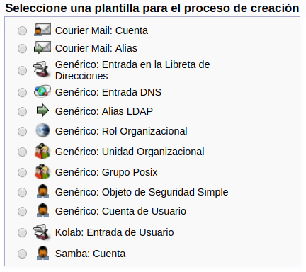
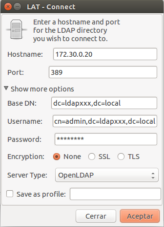

# Gestió LDAP amb interfície gràfica

## Gestió LDAP amb interfície gràfica

### phpLDAPadmin


#### Instal·lació phpLDAPAdmin

Per instal·lar una interfície web de gestió del directori LDAP, instal·la al servidor el **phpLDAPadmin** amb la comanda:

`apt install phpldapadmin`

Per configurar el **phpLDAPadmin** s'han de fer els següents canvis al fitxer `/etc/phpldapadmin/config.php`.

`sudo nano /etc/phpldapadmin/config.php`

1. Per tal que phpLDAPadmin accedeixi al nostre domini, cal **canviar la base del domini a dos llocs** `dc=example,dc=com` per `dc=ldapxxx,dc=local`

   > **Important**: Només s'ha de canviar en un lloc \(la resta són línies que estan comentades\). Les línies que comencen amb **\#** o **//** són comentaris i no cal modificar-les.

   ```text
   /* Array of base DNs of your LDAP server. Leave this blank to have phpLDAPadmin auto-detect it for you. */
   $servers->setValue('server','base',array('dc=ldapxxx,dc=local'));
   ```

   > Amb l'editor _**nano**_, es pot buscar text amb la combinació de tecles **Ctrl + W**.

2. **Canviar el DN de l'usuari amb qui s'ha de fer el** _**login**_ a phpldapadmin per administrar LDAP.

   > **Important**: Només s'ha de canviar en un lloc \(la resta són línies que estan comentades\).

   ```text
   /* The DN of the user for phpLDAPadmin to bind with. For anonymous binds or
   'cookie','session' or 'sasl' auth_types, LEAVE THE LOGIN_DN AND LOGIN_PASS
   BLANK. If you specify a login_attr in conjunction with a cookie or session
   auth_type, then you can also specify the bind_id/bind_pass here for searching
   the directory for users (ie, if your LDAP server does not allow anonymous
   binds. */
   $servers->setValue('login','bind_id','cn=admin,dc=ldapxxx,dc=local');
   ```

3. **Canviar el valor inicial dels identificadors d'usuaris \(uidNumber\) i grups \(gidNumber\)** per tal que no coincideixin amb els valors dels usuaris i grups locals. Convé canviar-los, per exemple, a **10000 i 10000**. Aquests paràmetres es troben en una **línia que cal descomentar i modificar**:

   ```text
   $servers->setValue('auto_number','min',array('uidNumber'=>10000,'gidNumber'=>10000));
   ```

4. També es poden **evitar avisos innecessaris** descomentant i modificant la següent línia:

   ```text
   $config->custom->appearance['hide_template_warning'] = true;
   ```

#### Accedir a phpLDAPadmin

Des de l’ubuntu desktop o qualsevol altre client, aneu a un **navegador web** i connecteu-vos al phpLDAPadmin posant l'adreça.

`http://172.30.A.20/phpldapadmin`

> Cal substituir _**IP\_SERVIDOR**_ per la IP del vostre servidor LDAP.

Us demanarà l'usuari \(hauria de ser `cn=admin,dc=ldapxxx,dc=local`\) i la seva contrasenya.


> Si les dades que apareixen al _login_ no són correctes, cal revisar els canvis fets a l'arxiu `/etc/phpldapadmin/config.php`

#### Problema amb les versions de PHP

Depenent de la versió de PHP que s'estigui utilitzant, **phpldapadmin** pot donar alguns problemes.

Per saber quina versió té instal·lada el sistema es pot utiltzar la comanda `php -v`

**Versions superiors a la 7.2**

En accedir a **phpldapadmin** surten un parell d'avisos:

* **Deprecated**: \_\_autoload\(\) is deprecated, use spl\_autoload\_register\(\) instead in **/usr/share/phpldapadmin/lib/functions.php** on line **54**
* **Deprecated**: Function create\_function\(\) is deprecated in **/usr/share/phpldapadmin/lib/functions.php** on line **1083**

Ens indiquen que hi ha funcions que han quedat obsoletes però encara es poden utilitzar.

De moment, **aquests avisos es poden ignorar**, però podria ser que en futures versions de PHP ja no es puguin utilitzar aquestes funcions i es produeixi un error que impedeixi utilitzar phpldapadmin.

> Sempre és recomanable buscar solucions als avisos abans que es produeixi l'error.

1. **Solució 1 - pas a pas:** [http://moodlecf.sapalomera.cat/apunts/smx/sox/uf2/nf2/2713-SolucioPHP.html](http://moodlecf.sapalomera.cat/apunts/smx/sox/uf2/nf2/2713-SolucioPHP.html)
2. **Solució 2 - reemplaçant el fitxer:** 

   1. Descarrega't el fitxer `functions.php` el teu ordinador:

      Fitxer `funcions.php` modificat: [funcions.php](https://drive.google.com/open?id=15fSJwwD_GsRkiF6D6ckFJNtQqrqYifCd)

   2. Envia el fitxer `functions.php` al teu servidor:

   `scp functions.php username@remotehost_IP:/usr/share/phpldapadmin/lib/functions.php`

#### Gestionar usuaris, grups i unitats organitzatives

Per crear usuaris, grups i unitats organitzatives heu d'escollir una d'aquestes opcions:

* **Unitats organitzatives**: _Generico: Unidad organizacional_
* **Grups**: _Generico: Grupo Posix_
* **Usuaris**: _Generico: Cuenta usuario_



**Dades de l'usuari**:

* _**Número UID**_: \(automàtic\)
* _**Nom comú \(cn\):**_ el sol posar el nom i cognom de l’usuari.
* _**ID del usuario**_: identificador del compte de l'usuari \(login\)
* _**Directorio personal**_: /home/**ldapxxx**/usuari

  És preferible posar el directori _home_ dels usuaris de LDAP en un directori diferent dels usuaris locals \(`/home/ldapxxx/...`\)

* _**Número GID**_: grup principal al què pertany l'usuari
* _**Contraseña**_: \*\*\*\*\*\* \(md5\)
* _**Consola de login**_: cap \(per defecte agafa `/bin/bash`\)

> Si al crear usuaris o grups, els **identificadors** d'usuaris o grups \(_**uid**_ i _**gid**_\) **són inferiors a 10000**, cal revisar els canvis fets a l'arxiu `/etc/phpldapadmin/config.php`.

#### Activar https

Donat que s’envien dades com noms d’usuari i contrasenyes, seria interessant enviar-ho a través d’https \(SSL\).

* Habilitar SSL:

  `sudo a2enmod ssl`

* Crear certificat:

  ```text
  sudo mkdir /etc/apache2/ssl
  sudo openssl req -x509 -nodes -days 365 -newkey rsa:2048 -keyout /etc/apache2/ssl/apache.key -out /etc/apache2/ssl/apache.crt
  ```

* Configurar apache per fer servir SSL, canviant a `/etc/apache2/sites-available/default-ssl.conf`:

  ```text
  SSLCertificateFile /etc/apache2/ssl/apache.crt
  SSLCertificateKeyFile /etc/apache2/ssl/apache.key
  ```

* Activar SSL virtual host:

  `sudo a2ensite default-ssl.conf`

* Provar la connexió: [https://ip\_servidor/phpldapadmin](https://ip_servidor/phpldapadmin)

### LAT \(_LDAP Administration Tool_\)

#### Instal·lació LAT

També hi ha programes per entorn gràfic que permeten gestionar LDAP de forma remota com per exemple **LAT \(**_**LDAP Administration Tool**_**\)** o **JXplorer**.

Es pot instal·lar **LAT** des del Centre de Software d'Ubuntu o per comandes:

`sudo apt install lat`

Per posar-lo en marxa és preferible fer-ho des de la consola:

`sudo lat`

Al posar-lo en marxa demanarà amb quin servidor LDAP es vol connectar:



## Documentació i recursos

* **Apunts SOX Pere Sánchez:** [**Instal·lació JXplorer**](http://moodlecf.sapalomera.cat/apunts/smx/sox/index.html?cap=1.8.5) **i** [**Gestió d’usuaris amb JXplorer**](http://moodlecf.sapalomera.cat/apunts/smx/sox/index.html?cap=1.8.6)
* **Apunts SOX Pere Sánchez:** [**Instal·lació LAT**](http://moodlecf.sapalomera.cat/apunts/smx/sox/index.html?cap=1.8.9) **i** [**Gestió d’usuaris amb LAT**](http://moodlecf.sapalomera.cat/apunts/smx/sox/index.html?cap=1.8.10)
* **Apunts SOX Pere Sánchez:** [**Diferències entre phpldapadmin, JXplorer i LAT**](http://moodlecf.sapalomera.cat/apunts/smx/sox/index.html?cap=1.8.12)

