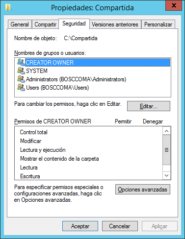
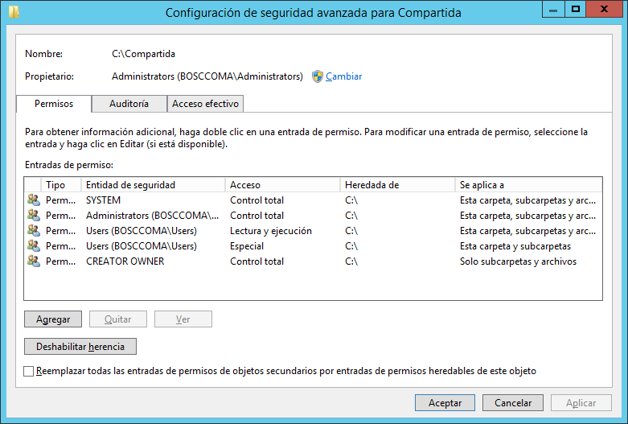
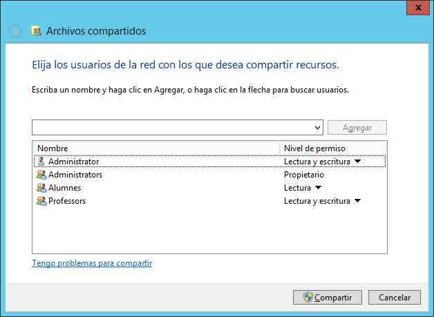
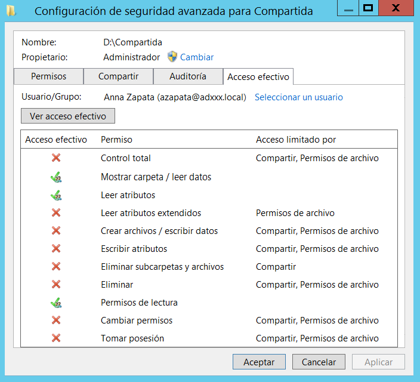
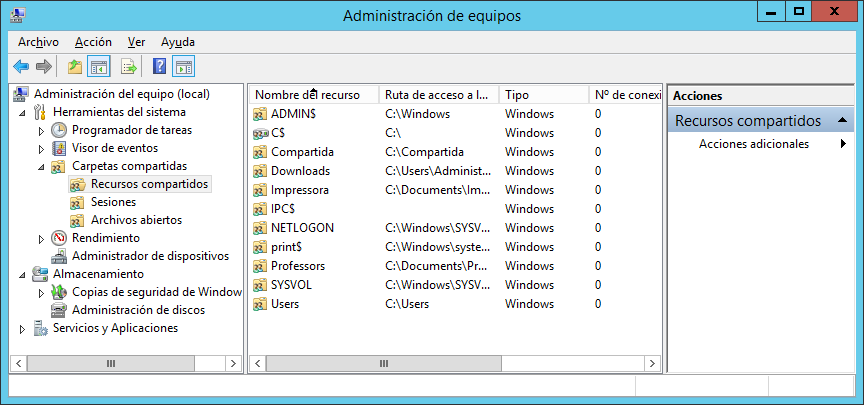
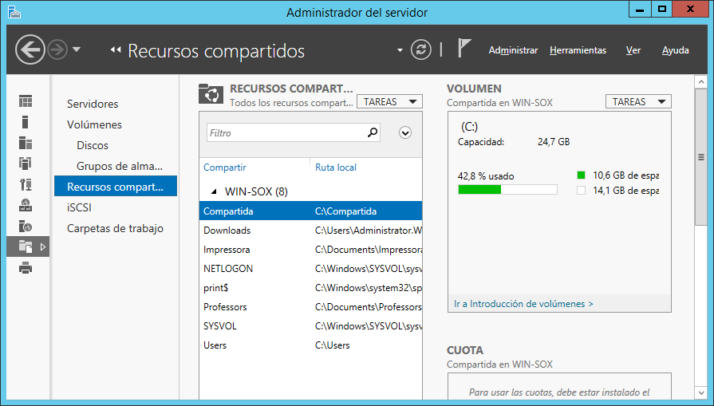
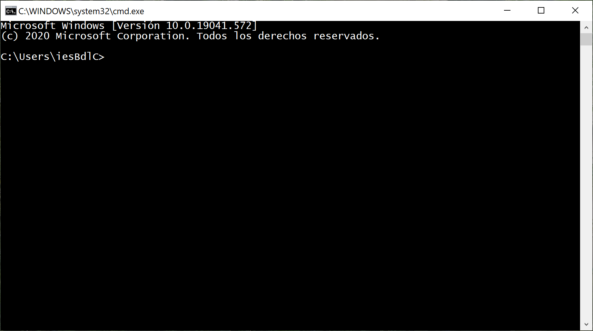

# Compartir arxius i carpetes en Windows

## Compartició de recursos en Windows

> Windows utilitza el protocol **CIFS** \(antigament anomenat **SMB**\) per compartir arxius, carpetes i impressores en un entorn en xarxa. També se'l sol anomenar **SMB/CIFS**.

### Recursos compartits

> Un **recurs compartit** és un objecte al qual es pot accedir de forma remota.

El recursos que es poden compartir són:

* **Arxius i carpetes**
* **Impressores**

> El **nom del recurs compartit** \(el que s'ha d'utilitzar quan s'accedeix de forma remota\) pot ser diferent del nom real.

### Permisos de compartició en Windows

#### Propietari d'un arxiu o carpeta

En Windows, cada carpeta i arxiu pertany a un usuari o a un grup d'usuaris, que és qui l'ha creat, però es pot canviar sempre que es tinguin els permisos per fer-ho.  
L'usuari o grup propietari, per defecte té tots els permisos.

#### Permisos per arxius i carpetes

A part del propietari, es poden afegir altres usuaris i grups, i assignar permisos diferents.

> Si un usuari pertany a dos grups, se sumen els permisos dels dos grups.

**Permisos locals \(de seguretat o NTFS\)**

Són els permisos que tindran els usuaris quan **accedeixin als recursos** \(arxius, carpetes i impressores\) **de forma local**.

Aquests permisos es poden configurar de forma simplificada o avançada.

**Permisos de compartició**

Quan s'accedeix a una carpeta o arxiu de forma remota, s'han de **combinar els permisos locals amb els de compartició**. Sempre s'aplica el permís **més restrictiu**.

Una forma de simplificar la gestió dels permisos quan es comparteixen arxius i carpetes és posar **Control total** als permisos de compartició i gestionar els permisos locals més detalladament.  
Això no sempre es pot fer \(depèn dels requeriments de seguretat\) però en la majoria de casos, sí.

#### Herència

Quan es crea una carpeta, aquesta **hereta els permisos de la carpeta pare**, però aquesta dependència es pot trencar per canviar i posar els permisos adequats a cada cas.

## Gestió de permisos locals

Per configurar els permisos locals cal anar a les **propietats de la carpeta** i entrar a la pestanya _**Seguridad**_.



### Gestionar els usuaris

Es poden afegir o eliminar usuaris i grups fent clic al botó _**Editar**_.

### Gestionar els permisos simples

Seleccionant l'usuari o grup es poden marcar o desmarcar les caselles _**Permitir o Denegar**_ en cada permís.

Per defecte, si no està marcada la casella _**Permitir**_, implica que no es té el permís corresponent.

### Opcions avançades

Amb el botó _**Opciones avanzadas**_ es poden canviar algunes propietats avançades:



#### Canviar el propietari

A més de canviar el propietari de la carpeta, també es pot canviar en els arxius i subcarpetes.

#### Habilitar / Deshabilitar la herència

En el cas de deshabilitar l'herència es pot triar entre dues opcions:

* **Mantenir els permisos actuals**: es fa una còpia dels permisos actuals però ara es podran modificar.
* **Esborrar tots els permisos**: s'hauran de crear de nou tots els permisos.

#### Gestionar els permisos avançats

Seleccionant un usuari o grup, es poden afegir, eliminar o editar els permisos avançats:


## Gestió de permisos de compartició

Abans de configurar els permisos de compartició que assegurar-se que s'ha [activat l'_**Ús compartit d’arxius i impressores**_](uf3-compartir-arxius-windows.md#activar-la-compartició-de-recursos)_**.**_

A continuació, per configurar els permisos de compartició cal anar a les **propietats de la carpeta** i entrar a la pestanya _**Compartir**_.


> Un cop s'hagi compartit la carpeta, la ruta que s'ha d'utilitzar per accedir de forma remota és la que apareix a _**Ruta de acceso de red:**_ `\\WIN-SOX\Compartida`.

### Compartició senzilla

Amb el botó _**Compartir**_, s'accedeix a les opcions per compartir la carpeta de forma senzilla.  
Només es poden afegir o eliminar **usuaris i grups**, i assignar-los permisos de **Lectura** o de **Lectura i escriptura**.



### Compartició avançada

Amb el botó _**Uso compartido avanzado**_, s'accedeix a les opcions per compartir la carpeta de forma avançada.


En aquest cas es disposa de més opcions per configurar la compartició:

* Marcar o desmarcar la casella _**Compartir esta carpeta**_ per compartir-la o deixar-la de compartir.
* Posar-li un **nom de recurs** compartir diferent del nom original. Aquest nom és el què s'ha d'utilitzar quan es vol accedir a aquest recurs de forma remota.
* Es pot establir el **nombre màxim d'usuaris** que poden utilitzar la carpeta simultàniament.
* Els **permisos** que es poden assignar són diferents: _**Llegir, Canviar i Control total**_.


> Es pot simplificar la configuració de permisos de compartició posant **Control total** a _**Compartició**_ i gestionar els permisos locals més detalladament a la pestanya _**Seguretat**_.

En alguns casos no es podrà fer així: per exemple, si es vol que els usuaris tinguin permís de lectura i escriptura quan accedeixin localment però només de lectura quan ho facin de forma remota.

### Veure els permisos efectius

És fàcil cometre errors al combinar permisos locals amb permisos compartits, i sol ser difícil descobrir quins són els permisos que estan mal configurats.

Per ajudar en aquesta tasca, es pot anar a permisos locals \(pestanya _**Seguridad**_\), clicar el botó _**Opciones avanzadas**_ i entrar a la pestanya **Acceso efectivo**.

Aquesta finestra permet comprovar quins permisos té un usuari i, en cas que no tingui un permís, saber si el problema està en la configuració dels permisos locals o en els permisos de compartició.

Primer cal **triar l'usuari o grup** i després clicar el botó _**Ver acceso efectivo**_.



En les **dues primeres columnes** s'indica si l'usuari o grup té o no un permís determinat.  
En cas que no el tingui, en la **tercera columna** s'indica el motiu:

* **Permisos de archivo**: no s'ha donat permís en la configuració de **permisos locals**.
* **Compartir**: no s'ha donat permís en la configuració de **permisos de compartició**.

### Carpetes compartides ocultes

Si es vol compartir un recurs però que **no sigui visible** \(només es podrà connectar qui conegui la ruta a aquest recurs\) només cal afegir un **$** darrera del nom del recurs.

* Per exemple: C$

Amb `\\ip_equip` o `\\nom_equip` es pot veure els recursos compartits **visibles**.

Es pot **accedir a un recurs compartit ocult** si es coneix tota la ruta.

* Per exemple: `\\192.168.0.1\C$`

## Veure i gestionar les carpetes compartides

### A través de l'Administrador d'equips

Es poden veure tot el relacionat amb els recursos que està compartint la màquina a _**Administración de equipos \[Computer Management\]**_, dins l'apartat _**Herramientas del sistema &gt; Carpetas compartidas**_.



**Recursos compartits**

En aquest apartat es poden veure la següent informació sobre els recursos compartits:

* **Nom del recurs:** és el nom del recurs compartit.
* **Ruta de la carpeta:** és la ruta sencera en el sistema local.
* **Tipus:** és el tipus d’ordinador que pot utilitzar el recurs.
* **Num. de connexions de client:** és la quantitat de clients que estan accedint al recurs en aquell precís moment.
* **Descripció:** és la descripció del recurs.

I també podem:

* Deixar de compartir-los
* Veure els permisos de compartició
* Veure els permisos locals

**Sessions**

Aquí es pot veure qui està accedint als recursos \(usuari o màquina\) i, si cal, tancar-li la sessió.

**Arxius oberts**

Mostra els arxius compartits que s'estan utilitzant i, si cal, es poden tancar.

### A través del Administrador del servidor

En l'_**Administrador del servidor \[Server Manager\]**_, dins de l'apartat _**Servicios de archivos i de almacenamiento \[File and Storage Services &gt; Shares\]**_.



* **Nom del recurs compartit:** és el nom del recurs compartit.
* **Ruta local:** és la ruta completa de la carpeta en el sistema local.
* **Protocol:** és el nom del protocol utilitzat per compartir la carpeta.
* **Espai lliure:** és la quantitat d’espai lliure en el disc si no hi ha quotes establertes.
* **Quota:** és el resum de l’estat de les quotes de l’administrador de recursos sobre la carpeta compartida.

### A través de comandes

Executant la a comanda `net share` permet veure les unitats que tenim compartides en l’equip actual.


## Accedir a carpetes compartides

Una forma fàcil d'accedir a les carpetes compartides en una màquina és a través de l'explorador d'arxius.

A l'apartat _**Red**_ es poden veure les màquines de la mateixa xarxa.

Seleccionant qualsevol d'elles es veuran les carpetes que comparteixen.

Si no apareix la màquina però es coneix la màquina i el nom del recurs compartit, es pot escriure en la barra d'adreces:

```text
\\NOM_SERVIDOR\Compartida 
o 
\\IP_SERVIDOR\Compartida
```

### Validació d'usuaris per accedir a carpetes compartides

Quan **s'intenta accedir a una carpeta compartida**, el sistema comprova si l'usuari i contrasenya amb el que s'ha accedit al sistema està reconegut per la màquina servidor, ens podrem trobar en dos casos:

* Si l'**usuari està reconegut** per la màquina servidor i té accés al recurs, aquest es podrà connectar.
* Si **no es reconeix l'identificador de l'usuari**, demanarà un usuari i contrasenya.

Si reconeix l'usuari i contrasenya, podrà accedir si té els permisos adequats. **Un cop a dins podrà realitzar diferents accions** en funció dels permisos que tingui: veure continguts, crear, modificar, esborrar...

Si volem **que es pugui connectar qualsevol usuari** caldrà donar permisos a l'**usuari convidat** i, si cal, habilitar aquest usuari.

### Connectar una unitat de xarxa a una carpeta compartida

Es pot connectar la carpeta compartida a una **unitat de xarxa** assignant-li una lletra d'unitat que estigui disponible.  
D'aquesta forma serà més fàcil accedir-hi, doncs apareixerà com una unitat d'emmagatzematge local.

Per fer la connexió, clicar amb el botó dret sobre _**Este equipo**_ i triar l'opció _**Conectar a unidad de red**_.

* **Unitat:** triar una lletra d'unitat que estigui lliure \(`X:`\).
* **Carpeta:** escriure la ruta o buscar-la \(`\\NOM\_EQUIP\Compartida\`\).
* **Conectar de nuevo al iniciar sesión:** connectar la unitat a la carpeta cada cop que l'usuari inicïï sessió.
* **Conectar con otras credenciales:** connectar amb un usuari diferent de l'actual.

### Connectar una unitat de xarxa a través de comandes

Per connectar-se a una unitat de xarxa i accedir als recursos que conté, només cal executar la comanda:

`net use`

Per **exemple**, si es vol accedir a un recurs anomenat `Compartida` que s'emmagatzema en una màquina anomenada `NOM_SERVIDOR` i la lletra de la unitat és la d, cal escriure el següent:

`net use d: \\NOM_SERVIDOR\Compartida`

o bé

`net use d: \\IP_SERVIDOR\Compartida`

## Problemes i altres configuracions

### Activar la compartició de recursos

Per activar l´ús compartit d'arxius i impressores cal el següent:

1. Cal anar al _**Centro de redes y recursos compartidos &gt; Cambiar configuración de uso compartido avanzado.**_
2. Activar l'opció _**Activar la detecció de xarxes.**_
3. Activar l’_**Ús compartit d’arxius i impressores**_.

Quan s'activa l’opció _**Ús compartit d’arxius i impressores**_, els usuaris de la xarxa podran tenir accés als arxius i impressores compartits en aquest equip.


### S'han canviat els permisos del fitxer o carpeta compartida però l'usuari continua amb el mateixos permisos al accedir des del client

Quan establim una connexió amb algun dispositiu de la xarxa el sistema operatiu guarda les dades de la connexió \(IP, port, MAC,...\). Si a més és una connexió a un recurs al que s'ha accedit amb usuari i contrasenya \(_credencials_\), a més de les dades de connexió es guardaran aquestes credencials.

_**Problema**_**:** Amb a la sessió d'un usuari en un client, provem d'accedir a un carpeta compartida pel servidor i diu que no té permisos. Modifiquem els permisos d'accés al servidor i tornem a provar l'accés però continua sense poder entrar. _\(això mateix pot ser al revés: l'usuari pot accedir/modificar/crear i ho volem impedir\)_

_**Què està passant?**_**:** \(Si hem comprovat que els permisos son correctes\) En el perfil d'usuari estan guardats els permisos antics o de sessió.

_**Solució 1 \(poc efectiu\)**_**:** Tancar sessió, tornar a obrir sessió i provar-ho novament.

_**Solució 2 \(massa radical\)**_**:** Reiniciar el sistema operatiu, tornar a obrir sessió i provar-ho novament. \(molt radical\)

_**Solució 3**_**:** Esborrar les credencials de usuari-contrasenya de la connexió feta al servidor.

1. Amb les tecles _Windows + R_ obrir la finestra de dialeg per executar: _`rundll32.exe keymgr.dll, KRShowKeyMgr`_       
2. Buscar la lP del l'ordinador on hi ha el recurs compartit i eliminar-la del llistat.     

_**Solució 4**_**:** Esborrar les credencials usuari-contrasenya de l'accés al recurs compartit amb _net use._

1. Obrim un _cmd_    __
2. Mirem les connexions guardades i localitzem la que volem eliminar: 

   `net use`   

3. Tenim dues opcions:

* _Opció 1: Eliminar la credencials de la connexió al recurs compartit._  
  `net use \\IP_server\recurs_compartit /delete`

  
  __`klist purge`  
  __

* _Opció 2: Eliminar totes les credencials de totes les connexions._

  _`net use * /d`_

