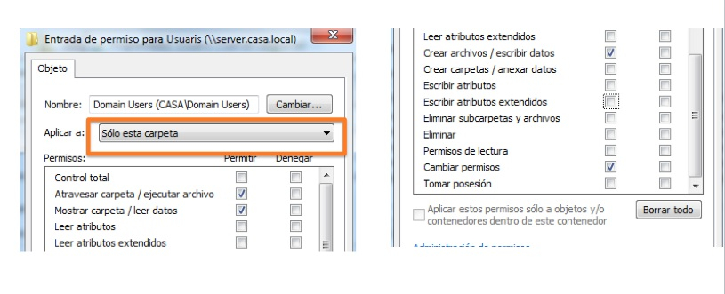
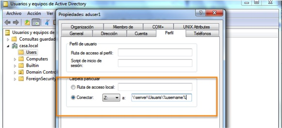
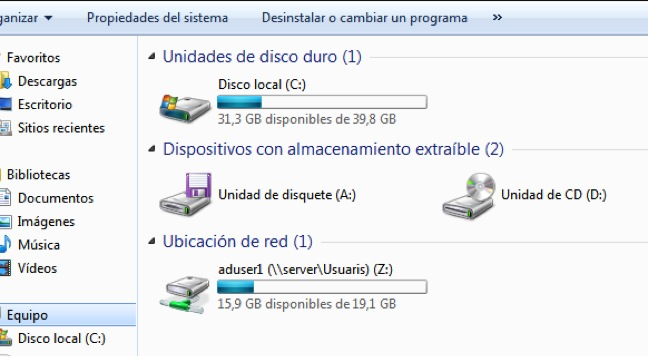

# Perfils mòbils en un domini Samba AD

## Creació de perfils mòbils

En general, la creació de [**perfils mòbils**](https://github.com/seicoll/sox/tree/0d2f60ffb695541608217beec864370e547005e0/UF1/perfils-usuari.html#què-és-el-perfil-dun-usuari) en un domini Samba és molt similar a la creació de perfils mòbils amb Active Directory si es fa des d'un client Windows unit al domini amb les eines d'administració remota \(RSAT\) que permeten configurar un domini \(usuaris, grups, recursos compartits...\).

## Configuració del servidor

### Crear i compartir les carpetes necessàries

Primer es creen les carpetes de:

* **perfils**: on aniran les carpetes \(documents, escriptori, vídeos, images, …\) dels usuaris. 
* **privades**: on aniran les carpetes personals dels usuaris.
* **compartida**: carpeta que es compartirà amb diversos usuaris o grups de domini.

Es poden crear a `/srv/samba` \(no cal preocupar-se pels permisos locals; la configuració es farà modificant els permisos de seguretat des del client Windows\):

```bash
sudo mkdir /srv/samba
sudo mkdir /srv/samba/perfils
sudo mkdir /srv/samba/privades
sudo mkdir /srv/samba/compartida
```

Després, per compartir-les amb Samba, afegim les següents línies a l'arxiu `/etc/samba/smb.conf`. Aquí es pot donar permís de lectura i escriptura a tothom, `read only = no`; la limitació de permisos es farà modificant els permisos de seguretat des del client Windows.

```text
[perfils]
    path = /srv/samba/perfils
    read only = no

[privades]
    path = /srv/samba/privades
    read only = no

[compartida]
    path = /srv/samba/compartida
    read only = no
```

Si no es vol esperar a què Samba actualitzi aquesta informació \(normalment no triga més d'un minut\), es pot reiniciar el servei:

```bash
sudo service smbd restart
sudo service nmbd restart
```

## Configuració del client

### Configurar els permisos de les carpetes compartides

Iniciant sessió amb l'administrador del domini Samba \(**administrator**\), des de l'explorador d'arxius busquem la carpeta compartida en el servidor i obrim els permisos de seguretat.

En el mode avançat, escollim **deshabilitar l'herència de permisos**.

> És important recordar que hem d'evitar que un usuari tingui accés a la carpeta personal d'un altre usuari, per això, és necessari **deshabilitar l'herència de permisos** de la carpeta `privades` a les carpetes filles creades dins seu.

Eliminem tots els permisos que apareguin i configurem només els permisos següents:

* Per a l'administrador \(**Administrator**\): control total sobre aquest directori, els subdirectoris i els fitxers
* Per al **propietari** \(_**CREATOR OWNER**_\): control total però **només sobre els subdirectoris i els fitxers**.
* Per als usuaris del domini \(**Domain users**\) o altres grups: els següents permisos avançats **només sobre aquest directori**.
  * Permís per travessar aquest directori / executar arxius.
  * Permís per mostrar carpeta / llegir dades.
  * Permís per crear carpetes / adjuntar dades.   

 

### Crear els scripts d'inici de sessió

Els scripts s'han de crear a la carpeta `netlogon` que es troba compartida en el servidor. Cal anar a _**Red &gt; Servidor &gt; netlogon**_ \(també es pot accedir posant l'adreça del servidor i el nom de la carpeta compartida: \IP\_servidor\netlogon\) i crear l'script.

> **ATENCIÓ**: els scripts han de ser arxius de text pla \(sense format\) i amb l'extensió `.bat`

Si en el perfil d'un usuari es configura un dels scripts creats en aquesta carpeta, les comandes de l'script s'executaran en la màquina client cada cop que l'usuari iniciï la sessió.

Algunes de les accions que es poden posar en aquests arxius són:

* Sincronitzar la data i hora amb el servidor
* Connectar una unitat de xarxa amb una carpeta compartida en el servidor
* Connectar una impressora compartida en el servidor

### Configurar els perfils

Ara només falta configurar el perfil dels usuaris per crear la seva carpeta personal i configurar l'script d'inici de sessió.

Iniciant sessió amb l'administrador del domini Samba \(_**administrator**_\), obrim les eines d'administració remota del servidor o directament l'_**Administració d'usuaris i equips del domini**_.

Seleccionem un usuari \(o uns quants a la vegada\), obrim la configuració del perfil amb _**Propietats &gt; Perfil**_ i introduim les següents dades:

* **Ruta del perfil**: `\\IP_SERVIDOR\perfils\%username%`
* **Script d'inici de sessió**: `script.bat` \(no cal posar la ruta\)
* **Carpeta privada**:   Unitat de xarxa Z:  Ruta \IP\_SERVIDOR\privades\%username%

> Podem utilitzem la variable `%username%` que es substitueix automàticament pel nom de l'usuari.



## Comprovació dels perfils mòbils

**En un client Windows unit al domini Samba, realitza les següents accions:**

* Inicia sessió amb un usuari del domini.

  Assegura't que no surt el missatge de què ha hagut de crear un perfil temporal.

* Guarda un document amb el seu nom a l'escriptori.
* Accedeix a la seva carpeta privada a través de la unitat de xarxa on es troba i guarda un arxiu amb el seu nom.



* Accedeix a la carpeta compartida amb altres usuaris a través de la unitat de xarxa on es troba i guarda un arxiu amb el seu nom si té permisos per llegir i escriure, o comprova si pot veure els arxius que han creat altres usuaris.
* Tanca la sessió.
* Iniciant sessió amb l'administrador del domini, comprova que s'ha creat un perfil mòbil per l'usuari anterior.

**En el servidor del domini Samba, fes les següents comprovacions:**

* Comprova que s'ha creat la carpeta del perfil d'aquest usuari i que dins de la carpeta _**Escritorio**_ hi ha l'arxiu que ha creat.
* Comprova que s'ha creat la seva carpeta personal i que dins d'aquesta carpeta hi ha l'arxiu que ha creat.
* Comprova que dins de la carpeta compartida amb altres usuaris hi ha l'arxiu que ha creat \(si tenia permisos per fer-ho\).

